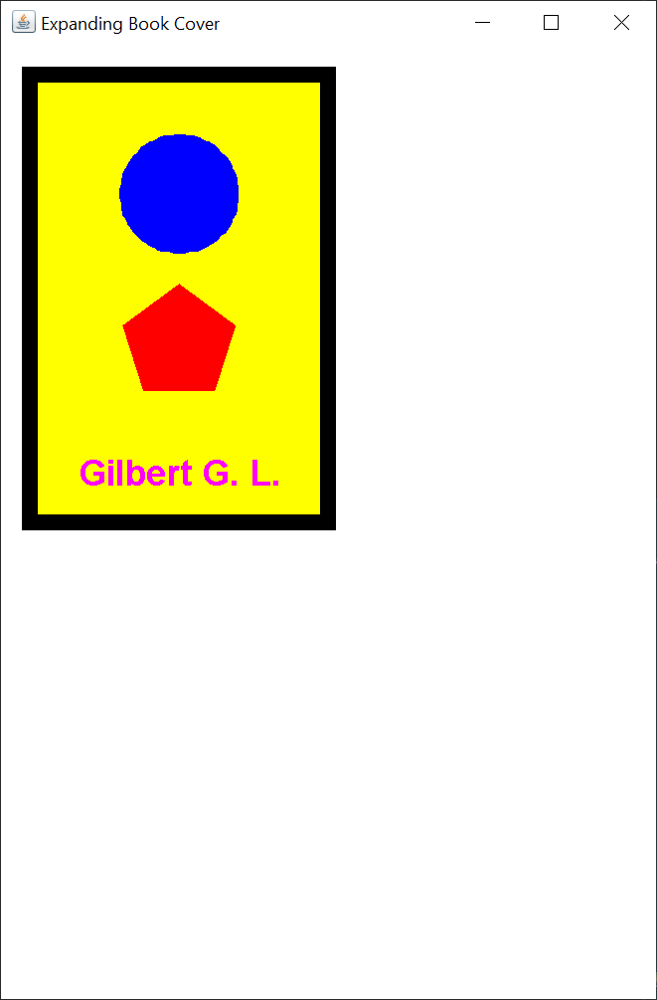
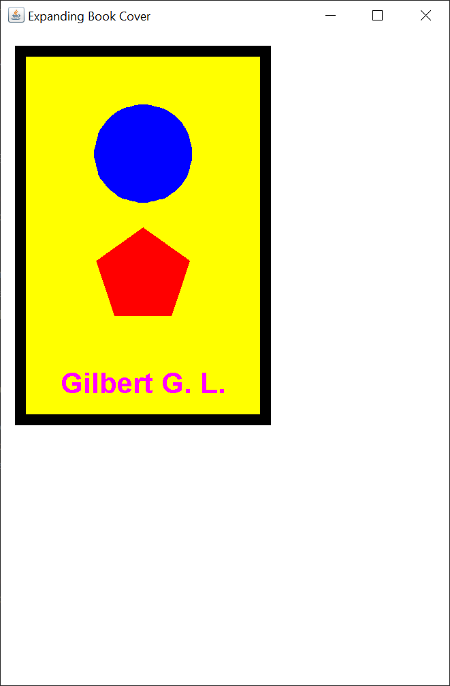
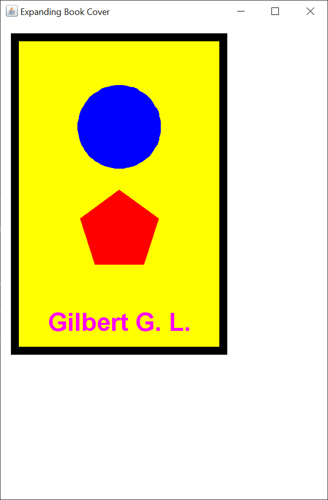
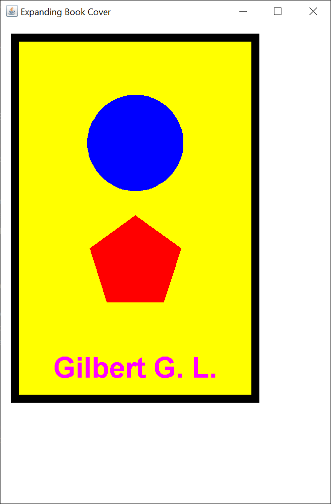
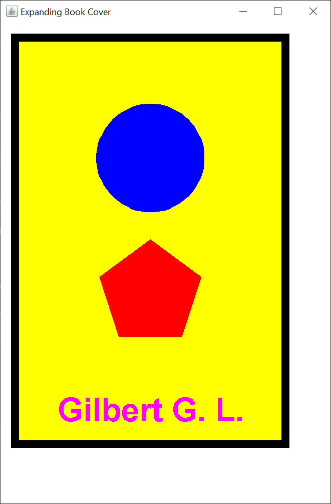
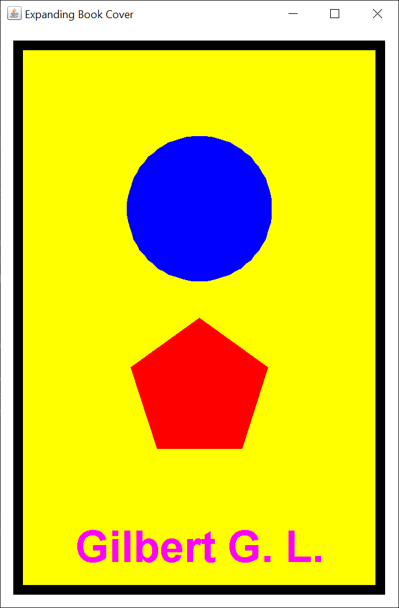

# Expanding Book Cover

## Introduction

Recently, on Stack Overflow, I saw the following homework assignment:

> Write a Java program using Graphics to draw a rectangle book cover which fulfills the requirements below. You can decide the sizes for all required items by yourself.

> 1. The cover will include a circle, a pentagon, and a string consisting of your first name initial and last name initial. Each of them and background will have different colors. The canvas will have a color different than the colors of all other items.

> 2. The book cover will first show up at the top left corner.

> 3. Then the book cover will increase their size by the factor of 1.2, 1.4, 1.6, 1.8, and 2.0 every 500ms.

I have no idea if the OP was supposed to use Processing or some other academic Java graphing package.  I used Java Swing.  Here's the GUI at 1.0.

At 1.2.

At 1.4.

At 1.6.

At 1.8.

At 2.0.

## Explanation

If you’re not familiar with Java Swing, Oracle has an excellent tutorial to get you started, [Creating a GUI With Swing](https://docs.oracle.com/javase/tutorial/uiswing/index.html). Skip the Netbeans section.

When I create a Swing GUI, I use the [model/view/controller](https://en.wikipedia.org/wiki/Model%E2%80%93view%E2%80%93controller) (MVC) pattern.  This pattern implies that you create the model first, then the view, then the controller.  The process is not a strict waterfall.  The more complex the GUI, the more iterative the process.

When creating a Swing GUI, the MVC model works like this:

- The view reads information from the model.
- The view does not update the model.
- The controller updates the model and revalidates/repaints the view

There's usually not one controller to "rule them all".  Each listener is responsible for its portion ot the model and the view.

I didn't code this entire GUI in one shot.  I wrote a little, tested a lot.  I added little pieces of code at a time, testing along the way.

### Model

I wrote one model class, `ExpandingBookCoverModel`.  The `ExpandingBookCoverModel` class is a plain Java getter/setter class that holds widths, heights, a radius for the circle and pentagon, a center point for the circle, a center point for the pentagon, a circle `Polygon`, and a pentagon `Polygon`.  I used polar coordinates to create the circle and pentagon and converted the polar coordinates to cartesian coordinates.  I'm pretty sure that's a math trick that most computer science students don't know.  Most of these values are recalculated for each drawing based on the current size of the expanding book cover.

### View

I created a `JFrame` and a drawing `JPanel`.  The `JFrame` is created in the `run` method of the `ExpandingBookCoverGUI` class.  The `JPanel` is created in the `DrawingPanel` class.  The `DrawingPanel` class extends `JPanel` so I can override the `paintComponent` method.  Generally, you don't extend a Swing component, or any Java class, unless you intend to override one or more of the class methods.

I start the Swing GUI with a call to the `SwingUtilities` `invokeLater` method.  This method ensures that the Swing components are created and executed on the [Event Dispatch Thread](https://docs.oracle.com/javase/tutorial/uiswing/concurrency/dispatch.html).

The `JFrame` methods have to be called in a specific order.  This is the order I use for most of my Swing applications.

The `JFrame` has a default `BorderLayoput`.  I place the drawing `JPanel` in the center of the `JFrame` `BorderLayout`.

The `paintComponent` method of the drawing `JPanel` starts with a call to the `super.paintComponent(g);` method.  This ensures that the Swing paint chain is maintained.

Because the circle and pentagon `Polygons` are created in the model, drawing the `Polygons` is straightforward.  The most complicated code in the `paintComponent` method is the code to calculate the X and Y of where to draw the author's name so the text is centered horizontally.

### Controller

Since this Swing GUI has no controls, the Swing `Timer` started in the `run` method of the `ExpandingBookCoverGUI` class executes the `TimerListener``actionPerformed` method every 500 milliseconds.  The `actionPerformed` method recalculates the model variables and causes the drawing `JPanel` to be repainted.  Creating a robust model class made the view and controller classes much simpler.
